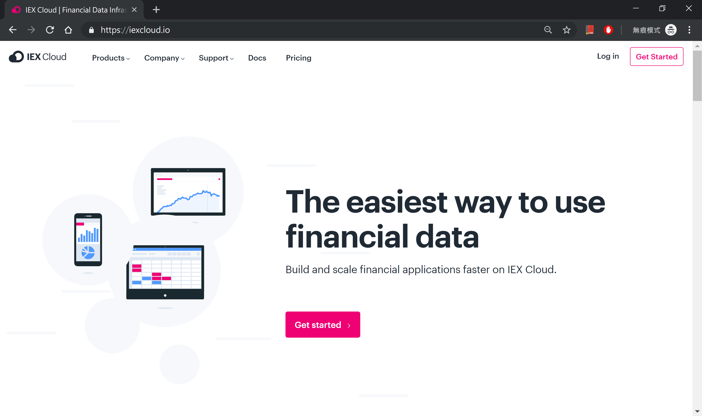
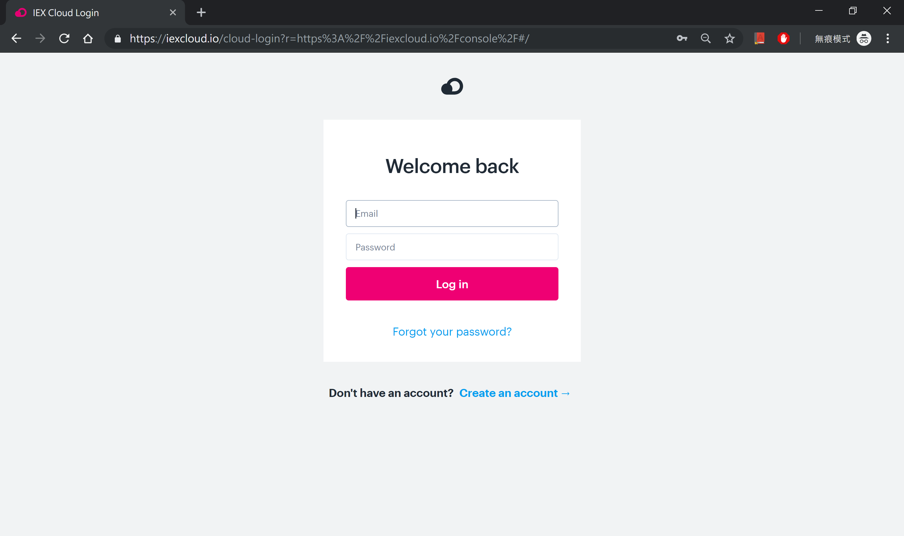
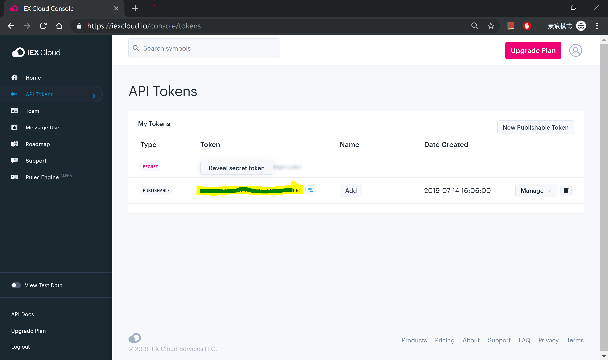

Currently, we are supporting you to use the followed financial data provider to get close prices of previous day:
- **IEX Cloud**

## IEX Cloud

1. go to [IEX Cloud](https://iexcloud.io/) homepage
 

2. **login** or **create account**
 

3. go to **console** page -> **API Tokens**
 

4. copy the api token and keep it for use within the **inertIA**